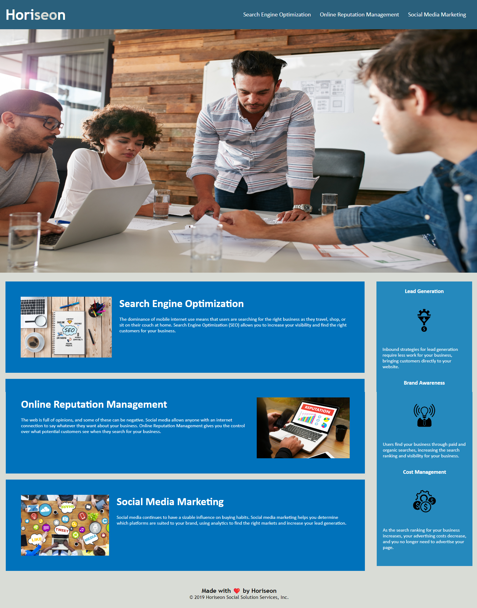

# On-the-job Challenge 1

## Description
- Marketing Agency hired me to refactor an existing site to make it more accessible.
- Added semantic HTML elements
- HTML elements follow a logical structure independent of styling and positioning
- Added accessible alt attributes
- Heading attributes fall in sequential order
- Added a concise title

- CSS selectors and properties are organized and follow a semnatic structure
- Added CSS comments and table of contents

## Screenshot

## Link to Deploy
[Website](https://akaydia.github.io/02-challenge/)
